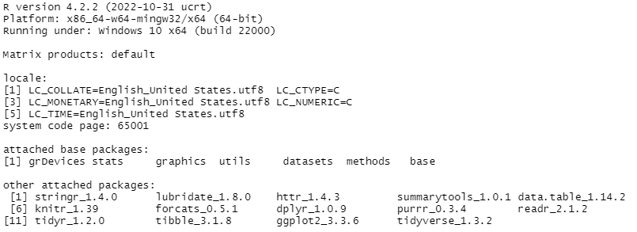
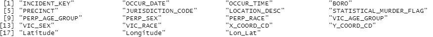
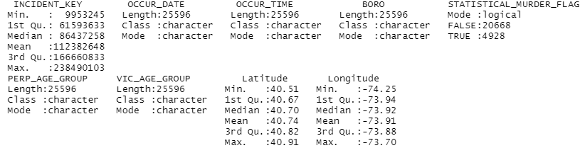
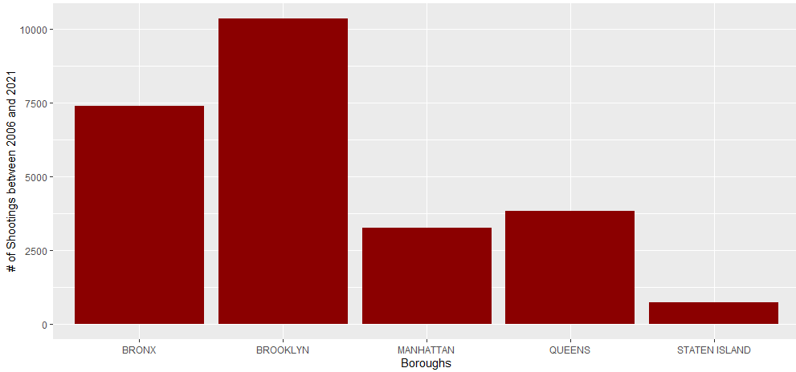
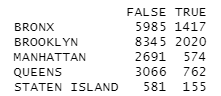
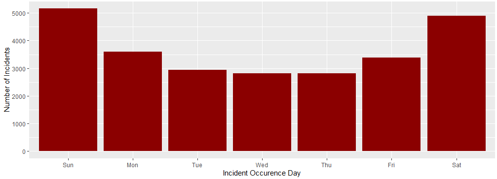
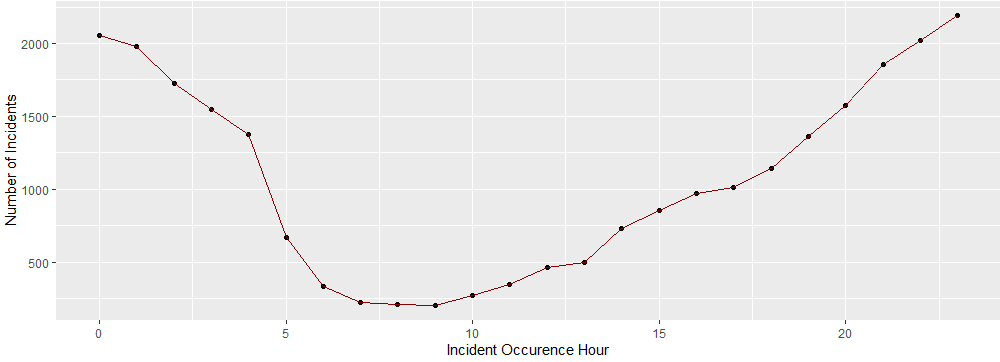
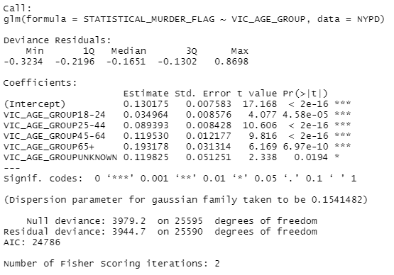

```{r setup, include=FALSE}
knitr::opts_chunk$set(echo = TRUE)
```

```
SessionInfo()
```




## Objectives:

1. Determine the neighborhood with the most shootings
2. Determine which neighborhood had the most incidents that were also murders
3. Determine when a shooting is most likely to occur


## Data Source:

The csv file comes from the [City of New York Open Data](https://catalog.data.gov/dataset).

csv: https://data.cityofnewyork.us/api/views/833y-fsy8/rows.csv


## Importing the data:

```
NYPD <- read.csv("https://data.cityofnewyork.us/api/views/833y-fsy8/rows.csv")
```


## Tidying the Data:

Used data.tables to format the data:

```
NYPD <- fread("~/R/NYPD_Shooting_Data.csv")
```

Checking columns:

```
colnames(NYPD)
```

 

Removed all null values:

```
na.omit(NYPD)
```

Selected only the columns I want to use for the project:

```
NYPD2 <- NYPD %>% select(INCIDENT_KEY, 
                   OCCUR_DATE,
                   OCCUR_TIME,
                   BORO, 
                   STATISTICAL_MURDER_FLAG,
                   PERP_AGE_GROUP,
                   VIC_AGE_GROUP,
                   Latitude,
                   Longitude)
```


Summary:

```
summary(NYPD2)
```




## Data Analysis:

The first item on the agenda is to determine which borough has the largest number of incidents:

```
ggplot(NYPD2) + 
  geom_bar(aes(x = BORO), fill = "red4") +
  labs(x="Boroughs", y="# of Shootings between 2006 and 2021") 
```




We can easily see that the answer is Brooklyn, and Staten Island with the least number. 

Now, how many of these shootings were murder cases? We can just make a table from the two columns to see the results. 

```
table(NYPD2$BORO, NYPD2$STATISTICAL_MURDER_FLAG)
```



The number of murder cases shows the same trend as the total number of shootings, with Brooklyn at the top of the list. 

To answer the day and time that NYC is the most dangerous, we'll create new columns in the NYPD2 data frame for the day and time data:


```
NYPD2$OCCUR_DAY = mdy(NYPD2$OCCUR_DATE)
NYPD2$OCCUR_DAY = wday(NYPD2$OCCUR_DAY, label = TRUE)
NYPD2$OCCUR_HOUR = hour(hms(as.character(NYPD2$OCCUR_TIME)))

```
Next, we can create separate data frames to count the number of incidents per day and also per hour:


```
NYPD3 <- NYPD2 %>%
  group_by(OCCUR_DAY) %>%
  count()

NYPD4 <- NYPD2 %>%
  group_by(OCCUR_HOUR) %>%
  count()

```

And now we can visualize our data:

```
ggplot(NYPD3, aes(x = OCCUR_DAY, y = n, )) +
  geom_col(fill = "red4") +
  labs(x = "Incident Occurence Day",
       y = "Number of Incidents") 
       
       
ggplot(data = NYPD4, aes(x = OCCUR_HOUR, y = n)) + 
  geom_point() +
  geom_line(color = "red4") +
  labs(x = "Incident Occurence Hour",
       y = "Number of Incidents") 

```






According to our analysis, Saturday and Sunday are the days with the most occurrences, and it is most dangerous to be out between the hours of approximately 8pm and 1am. 


## Making a model:

After the data analysis thus far, I became interested in how likely it would be for each age group to be involved in a shooting incident, so I created a model based on the victims' ages:


``` 
modelone.fit <- glm(STATISTICAL_MURDER_FLAG ~ VIC_AGE_GROUP, data = NYPD)
summary(modelone.fit)

```


From the data we can see that it is very likely that individuals between the ages of 25-44 will be a victim of a shooting incident in NYC. 


## Identifying Bias:

I, personally have visited NYC one time in my life and were not the victim of any crime during the visit. However, that doesn't mean there is no crime in the areas I saw or during the time of the visit. Most of my knowledge about what it's like to live in NYC comes from television. The popular shows "Brooklyn Nine Nine," and "Two Broke Girls," take place in Brooklyn and do showcase quite a bit of crime across each series. On the other end of the spectrum is "Gossip Girl," which takes place in Manhattan, which on the show, appears to be a mostly crime-free, wealthy area. So with little other information on crime statistics in NYC, most of my bias would come from watching television shows made to emulate life in NYC. 


Does my bias align with the data analysis?

While I expected Brooklyn to have the most shootings and murder incidents, I also expected Manhattan to be the lowest when Staten Island actually had the least number of incidents. Because we haven't analyzed the number of incidents based on local population (population data was not included in this data set), it's uncertain whether Manhattan or Staten Island is the more dangerous borough. In short, my personal bias did affect my initial hypothesis of the data, but did not hinder me from making an objective analysis. 


## Conclusion:

It was determined from a rough analysis of the NYPD Shooting Incident data that:


1. The borough with the most incidents is Brooklyn.
2. The borough with the most shootings that were also murders is Brooklyn.
3. Saturday and Sunday are the days with the most occurrences, and it is most dangerous to be out between the hours of approximately 8pm and 1am. 

